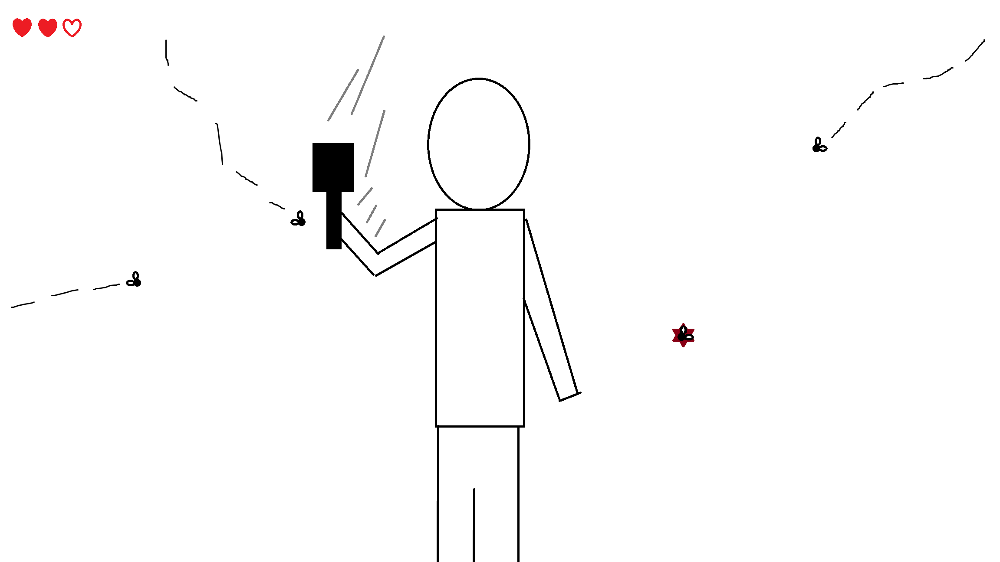
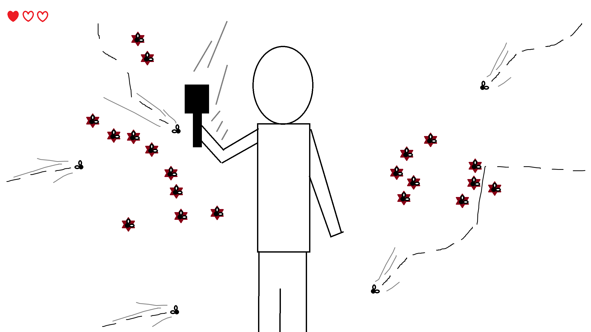
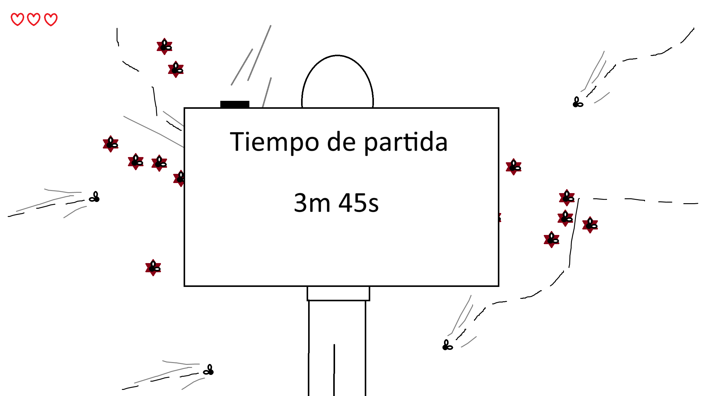

# Visión por Computador - Propuesta práctica final

La propuesta consiste en la realización de un minijuego de matar mosquitos. El juego comenzará pidiendo al jugador que agarre un matamoscas dibujado en la captura de cámara con su mano dominante. Una vez hecho esto empezaran a avanzar mosquitos desde el exterior del marco de la cámara que intentaran hacer contacto con el cuerpo del jugador. Si lo logran perderá 1 de las 3 vidas que dispone. El jugador deberá evitar esto desplazando el matamoscas para golpear a los mosquitos.

A medida que avance el tiempo la dificultad aumentara: el número de mosquitos en pantalla será mayor, serán más rápidos y algunos se moverán de manera más errática. Además, los mosquitos golpeados permanecerán aplastados en la pantalla, disminuyendo progresivamente la visibilidad.

Una vez el jugador pierda todas las vidas la partida acabara y mostrara el tiempo que ha sobrevivido.

## Autor
Javier A. Alfonso Quintana